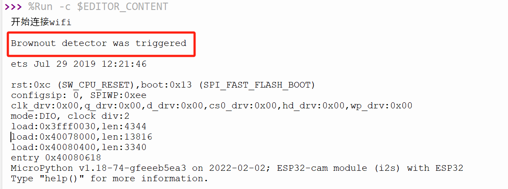
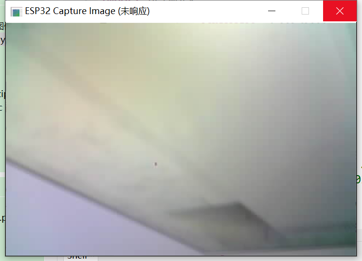

# 开启第一步：环境搭建与拍照测试

> 参考资料：
>
> 文章：[1. 开发环境搭建 (itprojects.cn)](https://doc.itprojects.cn/A0001.micropython.esp32/01.doc.5ec0ceed6860b084b258559aa19c2534/index.html#/01.dajianhuanjing)

我这里使用`Python`，而非`C`。

---

## 下载Thonny：

Thonny 是一个适用于 **Python 编程**的集成开发环境（IDE），特别适合初学者使用。它支持 MicroPython，这是 ESP32 上常用的编程语言。Thonny 可以用来编写、调试和运行代码，直接与 ESP32 进行交互。


Windows（`64`位电脑，`win8`，`win10`，`win11`用户）：https://doc.itprojects.cn/A0001.micropython.esp32/02.download/03.thonny/thonny-4.0.1.exe

## 下载MicroPython:

MicroPython 是一个为微控制器设计的 Python 语言的精简版本。它可以**运行在 ESP32 上，允许开发者通过 Python 编程控制硬件**。ESP32 支持通过 MicroPython 来编写脚本并控制硬件（如引脚、传感器等），适合快速原型开发。

- 官网下载地址：https://micropython.org/download/esp32/

- ==带摄像头库==的新固件，下载地址：https://doc.itprojects.cn/A0002.esp32cam/02.download/02.micropython.bin/micropython_camera_feeeb5ea3_esp32_idf4_4.bin

- v1.19版(推荐，此版本稳定)：https://doc.itprojects.cn/A0001.micropython.esp32/02.download/01.micropython.bin/esp32-20220618-v1.19.1.bin

## 串口驱动340：

这个驱动通常是用于在计算机和 ESP32 之间建立串口通信。340 可能是某个特定的 USB 转串口适配器（如 CH340）驱动程序版本。这是 **ESP32 与计算机通信的基础驱动程序**。

- 为了能够让电脑上的Thonny软件可以通过串口控制ESP32，需要安装驱动，下载地址如下

https://doc.itprojects.cn/A0002.esp32cam/02.download/01.driver/CH341SER.EXE

- [CH341SER.ZIP - 南京沁恒微电子股份有限公司 (wch.cn)](https://www.wch.cn/downloads/CH341SER_ZIP.html)


## 下载并烧录 ESP32 驱动：

这是 ESP32 使用的 USB 驱动程序，用于在电脑和 ESP32 之间建立连接。这个驱动程序允许计算机通过 USB 与 ESP32 进行数据传输、程序下载等操作。通常，**ESP32 需要安装这个驱动才能在计算机上正常工作**，尤其是当 ESP32 通过 USB 连接到计算机时。

- 下载地址：https://doc.itprojects.cn/A0001.micropython.esp32/02.download/02.driver/esp32usbDriver.zip


> **Thonny** 是开发环境，**MicroPython** 是编程语言，**串口驱动340** 和 **ESP32 USB 驱动** 是支持硬件连接的驱动程序。

## 报错信息：

### Device is busy or does not respond (设备忙碌或没有响应)：

在完成驱动烧录后连接`thonny`的时候出现如下的报错：


经过网上查询得知出现这个问题是由于烧录座的驱动有问题不是`CH340`的，所以会提示引脚占用，导致繁忙报错，可以参考如下的解决方案：

- （不推荐，我没试过）如果是使用烧录座的话，是需要改烧录座的硬件结构的：

> [【详细教程】使用Thonny通过烧录座为ESP32-CAM准备Micropython_thonny esp32-CSDN博客](https://blog.csdn.net/cjl1581828388/article/details/144633347?spm=1001.2101.3001.6650.4&utm_medium=distribute.pc_relevant.none-task-blog-2~default~YuanLiJiHua~Position-4-144633347-blog-129330417.235^v43^control&depth_1-utm_source=distribute.pc_relevant.none-task-blog-2~default~YuanLiJiHua~Position-4-144633347-blog-129330417.235^v43^control)

- （可能没有需要买）更换使用`CH340`串口调模块（USB-TTL）：


注意：`5V`的竖直头的跳线那里的黄色插件不要拔出来，否则会导致该模块无法正常使用，电脑连接不到。

- （推荐，应该都有）使用`ST`的烧录器也可以：

**先烧录固件（带摄像头的）时的**接线方式：(后面会解释为什么要区分接线方式)


该图仅连接示意，需要看看自己的烧录器的引脚，对照着连接即可。

---

> [ESP32-CAM 使用 MicroPython 进行开发 - 使用图形化工具 Thonny (Windows)_micropython图形化编程-CSDN博客](https://blog.csdn.net/m0_50614038/article/details/129330417?utm_medium=distribute.pc_relevant.none-task-blog-2~default~baidujs_baidulandingword~default-1-129330417-blog-140246252.235^v43^control&spm=1001.2101.3001.4242.2&utm_relevant_index=3)

参考上面的博客，按`下载模式`接线并配置下载后，按下`ESP32_CAM`上的按键`RST`后，依然出现如下的提示：


看到这个信息表示==你的ESP32 进入了 下载模式，正在等待通过串口（UART0/UART1）下载新的固件==。


这是正常的，因为现在是下载模式，具体而言是由于==**GPIO0 引脚被拉低** – ESP32 在启动时，如果 GPIO0 被拉低，就会进入下载模式==，而前面我们讲`GPIO0`连接`GND`接地了，使得其引脚为低电位，从而为下载模式，所以我们只需要**拔掉连接`GPIO0`和`GND`线即可让`ESP32_CAM`加入调试模式（可执行程序）**。


注意的话就是，正常供电需要稳定在`3.3V`，这里使用`5V`也可以，注意对应接线同为`5V`即可。

---


---

进入可编程模式后出现如下内容说明成功连接：


测试程序：

```python
import camera

# 初始化摄像头
camera.init(0, format=camera.JPEG, fb_location=camera.PSRAM)

# 拍摄一张图片
buf = camera.capture()  # 大小是640x480

# 保存图片到文件
with open("第一张图片.png", "wb") as f:
    f.write(buf)  # buf中的数据就是图片的数据，所以直接写入到文件就行了
    print("拍照已完成，点击Thonny左侧【MicroPython设备】右侧的三，\n然后看到‘刷新’，点击刷新会看到 图片，\n然后右击图片名称，选择下载到电脑的路径即可...")
```

运行：


此时在左侧显示的`.png`图片是以二进制存储的数据，需要选中后右键选择下载，然后到对应的路径即可找到拍摄的保存图片：


其保存的图片尺寸是由接上的摄像头参数决定的。至此完成连接与代码测试。

---

# 连接到PC端利用opencv实时显示图像

## 报错信息:

### 重启导致代码执行失败



这表明ESP32的电源出现了问题，具体来说是**低电压**导致了设备重启。

**"Brownout detector"** 是ESP32的一项功能，用来监测电压是否低于安全运行的范围。当前电源可能无法提供足够的电流或电压来稳定运行ESP32，尤其是在Wi-Fi连接时，ESP32需要更多的功率。如果电源电压波动过大，ESP32会触发这一错误并重启。



